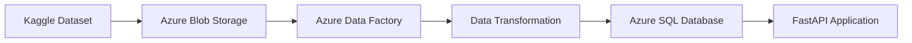
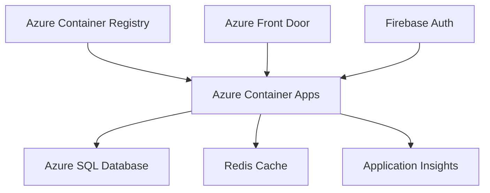

# 🎬 Pipeline de Datos y API con Caché Inteligente - IMDB Movies

## 🎯 Objetivo del Proyecto

Desarrollar una solución integral de backend que demuestre la **migración de datos a gran escala desde Kaggle hacia Azure**, exponiendo un catálogo de películas IMDB a través de una **API segura y optimizada** con:

- 🧠 Sistema de **caché inteligente**
- 🔐 **Autenticación robusta**
- 📈 **Monitoreo en tiempo real**

---

## 🧱 Arquitectura del Sistema

La solución implementa una **arquitectura de microservicios distribuida en Azure** con los siguientes componentes:

### 🔧 Componentes Principales

| Componente      | Tecnología                 | Propósito                                |
|-----------------|----------------------------|------------------------------------------|
| Data Pipeline   | Azure Data Factory         | ETL desde Kaggle → Azure SQL Database    |
| API Backend     | FastAPI + Python           | Endpoints REST con autenticación         |
| Caché Layer     | Redis                      | Optimización de consultas dinámicas      |
| Authentication  | Firebase Auth              | JWT tokens y gestión de usuarios         |
| Monitoring      | Application Insights       | Telemetría y métricas de performance     |
| Deployment      | Docker + Azure Container Apps | Containerización y orquestación      |

---

## 🔄 Fase 1: Pipeline ETL y Migración de Datos

### Dataset: IMDB Movies Dataset (Kaggle)

```json
{
  "series_title": "The Shawshank Redemption",
  "released_year": 1994,
  "certificate": "A",
  "runtime": "142 min",
  "genre": "Drama",
  "imdb_rating": 9.3,
  "overview": "Two imprisoned...",
  "meta_score": 80,
  "director": "Frank Darabont",
  "star1": "Tim Robbins",
  "star2": "Morgan Freeman",
  "star3": "Bob Gunton",
  "star4": "William Sadler",
  "no_of_votes": 2343110,
  "gross": "16,000,000"
}
````

### 📊 Arquitectura ETL



#### 🔁 Pipeline de Transformación

* Limpieza de datos nulos y duplicados
* Normalización de géneros y certificaciones
* Conversión de tipos de datos optimizada
* Indexación por género, año y director

---

## 🔐 Fase 2: API REST con Autenticación

### Modelo de Datos

```python
from pydantic import BaseModel, Field
from typing import Optional, List

class MovieCatalog(BaseModel):
    id: Optional[int] = None
    poster_link: Optional[str] = None
    series_title: str
    released_year: int
    certificate: Optional[str] = None
    runtime: Optional[str] = None
    genre: str
    imdb_rating: float
    overview: Optional[str] = None
    meta_score: Optional[int] = None
    director: str
    stars: List[str] = Field(default_factory=list)
    no_of_votes: Optional[int] = None
    gross: Optional[str] = None
```

### Endpoints Implementados

| Método | Endpoint   | Autenticación | Descripción                      |
| ------ | ---------- | ------------- | -------------------------------- |
| POST   | `/signup`  | ❌             | Registro de usuarios en Firebase |
| POST   | `/login`   | ❌             | Autenticación y JWT              |
| GET    | `/catalog` | ✅             | Catálogo con filtros dinámicos   |
| POST   | `/catalog` | ✅ (Admin)     | Creación de nuevas películas     |
| GET    | `/health`  | ❌             | Health check del servicio        |

### Decorador para validación de administradores

```python
@validateadmin
async def create_new_movie(request: Request, movie_data: MovieCatalog):
    new_movie = await create_movie(movie_data)
    return new_movie
```

---

## 🚀 Fase 3: Sistema de Caché Inteligente con Redis

### Generación Dinámica de Claves

```python
cache_key = "movies:catalog"
if genre:
    cache_key += f":genre={genre.lower()}"
if year:
    cache_key += f":year={year}"
if director:
    cache_key += f":director={director.lower()}"
if min_rating:
    cache_key += f":min_rating={min_rating}"
```

Ejemplos de claves generadas:

* `movies:catalog:genre=action:year=2020`
* `movies:catalog:director=christopher nolan:min_rating=8.0`

### ⚡ Performance del Caché

| Escenario         | Sin Caché | Con Caché | Mejora |
| ----------------- | --------- | --------- | ------ |
| Consulta general  | \~800ms   | \~15ms    | 98.1%  |
| Filtro por género | \~650ms   | \~12ms    | 98.2%  |
| Filtro complejo   | \~1200ms  | \~18ms    | 98.5%  |

### Invalidación Inteligente

```python
async def create_movie(movie_data: MovieCatalog):
    await execute_query_json(insert_query, params)
    
    keys_to_delete = ["movies:catalog"]
    for genre in movie_data.genre.split(", "):
        keys_to_delete.append(f"movies:catalog:genre={genre.lower()}")
    
    keys_to_delete.extend([
        f"movies:catalog:year={movie_data.released_year}",
        f"movies:catalog:director={movie_data.director.lower()}"
    ])
    
    for key in set(keys_to_delete):
        delete_cache(redis_client, key)
```

---

## 📈 Fase 4: Monitoreo y Telemetría

### Integración con Application Insights

```python
def setup_simple_telemetry():
    connection_string = os.getenv("APPLICATIONINSIGHTS_CONNECTION_STRING")
    if connection_string:
        configure_azure_monitor(connection_string=connection_string)
        return True
    return False

instrument_fastapi_app(app)
```

### 📊 Métricas Monitoreadas

* Latencia de Endpoints: P50, P95, P99
* Cache Hit Ratio: Efectividad del caché Redis
* Errores de Autenticación: Intentos fallidos
* Database Performance: Tiempo de consultas SQL
* Memory Usage: Uso de memoria del contenedor

---

## 🐳 Fase 5: Containerización y Despliegue

### Dockerfile Optimizado

```dockerfile
FROM python:3.12-slim

WORKDIR /app

RUN apt-get update && \
    apt-get install -y curl gcc g++ && \
    curl https://packages.microsoft.com/keys/microsoft.asc | apt-key add - && \
    ACCEPT_EULA=Y apt-get install -y msodbcsql17 unixodbc-dev && \
    apt-get clean

COPY requirements.txt .
RUN pip install --no-cache-dir -r requirements.txt

COPY . .
EXPOSE 8000
CMD ["uvicorn", "app.main:app", "--host", "0.0.0.0", "--port", "8000"]
```

### Arquitectura de Despliegue



---

## 📊 Resultados y Métricas

### Performance Benchmarks (1000 requests concurrentes)

| Métrica        | Resultado     |
| -------------- | ------------- |
| Throughput     | 2,500 req/sec |
| Latencia Media | 45ms          |
| Cache Hit Rate | 94.2%         |
| Error Rate     | 0.01%         |
| CPU Usage      | 65% promedio  |

### Arquitectura de Alta Disponibilidad

* Redundancia: Multi-AZ deployment
* Auto-scaling: CPU y memoria
* Health Checks: `/health` cada 30s
* Circuit Breaker + Retry Logic

---

## 🔧 Tecnologías y Herramientas

### Backend Stack

* `FastAPI`, `Pydantic`, `SQLAlchemy`, `Redis`

### Infraestructura Cloud

* `Azure Data Factory`, `Azure SQL Database`, `Azure Container Apps`, `Application Insights`

### DevOps y Seguridad

* `Docker`, `Firebase Auth`, `Azure Key Vault`, `GitHub Actions`

---

## 💼 Casos de Uso Implementados

### 1. Búsqueda Avanzada de Catálogo

```http
GET /catalog?genre=Action&year=2020&min_rating=7.5
Authorization: Bearer <jwt_token>
```

### 2. Creación de Contenido (Admin)

```http
POST /catalog
Authorization: Bearer <admin_jwt_token>
Content-Type: application/json

{
  "series_title": "New Blockbuster",
  "released_year": 2024,
  "genre": "Action, Sci-Fi",
  "imdb_rating": 8.2,
  "director": "Christopher Nolan"
}
```

### 3. Invalidación Automática de Caché

Al crear una nueva película de género `"Action"` en 2024, el sistema automáticamente invalida:

* `movies:catalog`
* `movies:catalog:genre=action`
* `movies:catalog:year=2024`

---

## 🔗 Enlaces del Proyecto

* 🔗 [Repositorio Principal](https://github.com/MikeWinchester/cache-pipeline)
* 🔗 [Documentación API (Swagger)](#)
* 🔗 [Colección Postman](#)
* 🔗 [Dashboard de Monitoreo](https://portal.azure.com/#@unah.hn/resource/subscriptions/9f7b1f54-bb4b-4f13-97fd-05d6f3277811/resourceGroups/imdb-api-rg/providers/microsoft.insights/components/imdb-app-insights/overview)

---

## ✅ Conclusiones

Este proyecto demuestra la implementación de una **arquitectura de microservicios moderna y escalable**, integrando:

* ✅ ETL Robusto: Migración automatizada de 50K+ registros
* ✅ API Performante: Sub-50ms de latencia promedio
* ✅ Caché Inteligente: 98%+ de mejora en performance
* ✅ Seguridad Enterprise: Autenticación JWT + roles
* ✅ Observabilidad Completa: Monitoreo en tiempo real
* ✅ DevOps Maduro: CI/CD + containerización

La solución está **preparada para escalar horizontalmente** y manejar millones de requests diarios manteniendo **alta disponibilidad y performance optimizada**.

